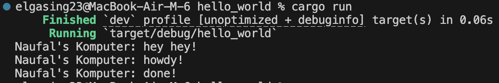
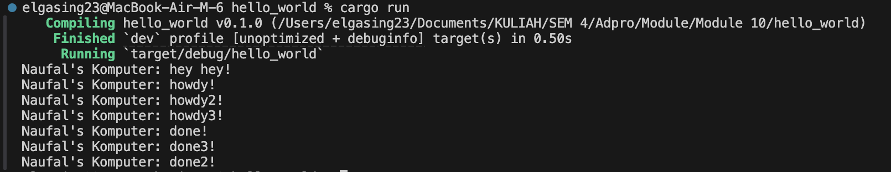
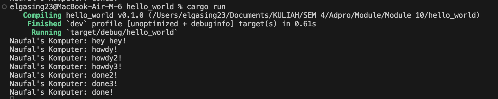
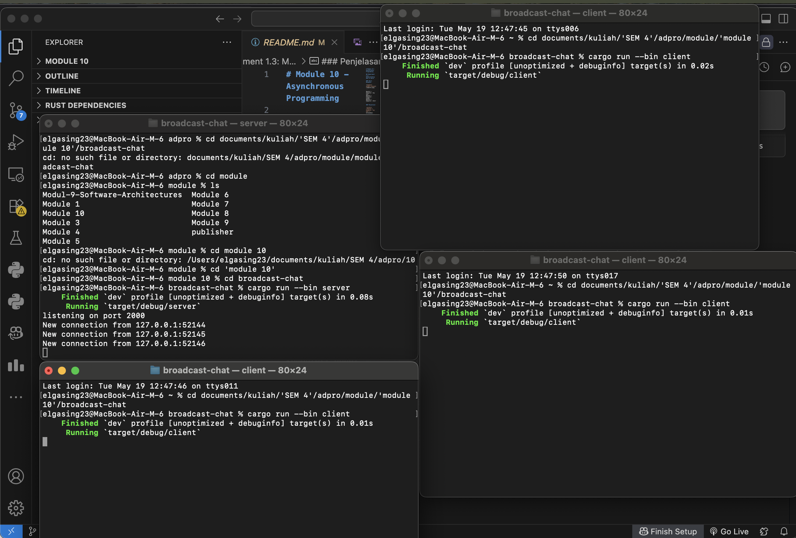
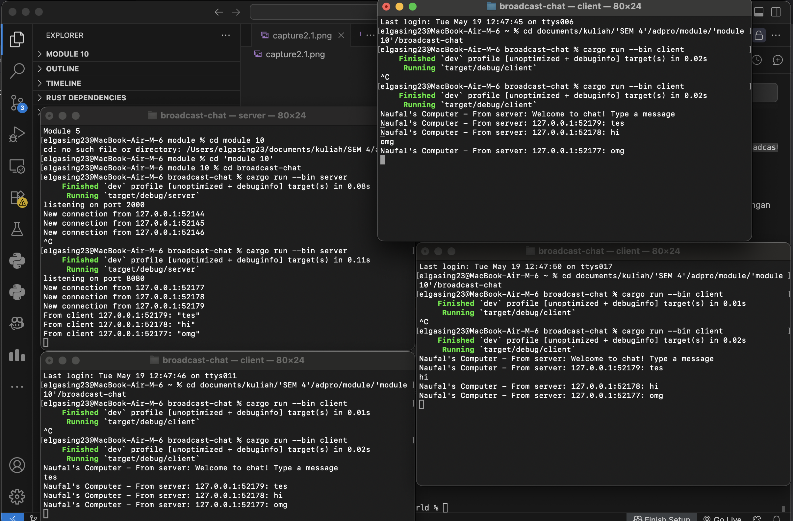
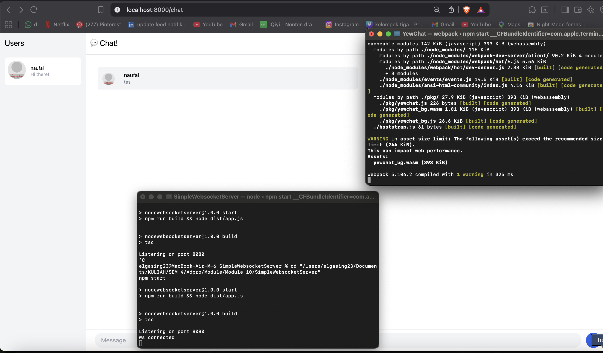

# Module 10 - Asynchronous Programming

## Experiment 1.2: Understanding How It Works

### Hasil Eksekusi



```
Naufal's Komputer: hey hey!
Naufal's Komputer: howdy!
Naufal's Komputer: done!
```

### Penjelasan

`println!("Naufal's Komputer: hey hey!")` diletakkan **setelah** `spawner.spawn(...)` tetapi **sebelum** `drop(spawner)` dan `executor.run()`. Namun, teks tersebut justru muncul **paling pertama**, sebelum "howdy!" dan "done!".

Hal ini terjadi karena `spawner.spawn(...)` **tidak langsung menjalankan** async block. Fungsi ini hanya memasukkan future ke dalam sebuah channel (antrian). Async block masih dalam kondisi diam — belum berjalan sama sekali.

Main thread kemudian melanjutkan eksekusi secara sinkron dan menemui `println!("hey hey!")`, sehingga langsung dicetak ke terminal.

Barulah setelah `drop(spawner)` menutup channel, `executor.run()` mulai melakukan polling terhadap future yang ada di antrian. Pada titik ini async block berjalan: mencetak "howdy!", lalu berhenti sejenak selama 2 detik menunggu `TimerFuture`, dan akhirnya mencetak "done!" setelah thread timer membangunkan waker.

Singkatnya: **spawn hanya mengantrekan future, bukan menjalankannya.** Executor baru mengeksekusi future ketika `executor.run()` dipanggil. Itulah mengapa kode sinkron yang ditempatkan antara `spawn` dan `run` selalu dieksekusi lebih dulu sebelum pekerjaan async apapun dimulai.

---

## Experiment 1.3: Multiple Spawn and Removing Drop

### Hasil Eksekusi — Multiple Spawn (dengan `drop`)



```
Naufal's Komputer: hey hey!
Naufal's Komputer: howdy!
Naufal's Komputer: howdy2!
Naufal's Komputer: howdy3!
Naufal's Komputer: done3!
Naufal's Komputer: done!
Naufal's Komputer: done2!
```

### Hasil Eksekusi — Tanpa `drop(spawner)`



```
Naufal's Komputer: hey hey!
Naufal's Komputer: howdy!
Naufal's Komputer: howdy2!
Naufal's Komputer: howdy3!
Naufal's Komputer: done3!
Naufal's Komputer: done2!
Naufal's Komputer: done!
[program tidak berhenti / hang]
```

### Penjelasan

**Multiple Spawn**

Ketika tiga `spawner.spawn(...)` dipanggil, ketiganya memasukkan future ke dalam antrian channel tanpa langsung dieksekusi. Saat `executor.run()` mulai bekerja, executor mem-poll task pertama hingga task tersebut mengembalikan `Poll::Pending` (ketika menunggu timer). Lalu executor beralih ke task berikutnya, dan seterusnya. Itulah mengapa urutan "howdy!", "howdy2!", "howdy3!" muncul berurutan — ketiga task dimulai sebelum satupun selesai.

Urutan "done!" bisa tidak berurutan (done3 muncul lebih dulu) karena ketiga timer thread berjalan secara konkuren. Thread mana yang selesai lebih dulu akan me-wake task-nya lebih dulu, sehingga urutannya bergantung pada scheduling sistem operasi dan tidak deterministik.

**Menghapus `drop(spawner)`**

Ketika `drop(spawner)` dihapus (di-comment), channel **tidak pernah ditutup** karena `Spawner` masih memegang satu sender yang aktif. `executor.run()` menggunakan `while let Ok(task) = self.ready_queue.recv()` — fungsi `recv()` akan **memblokir selamanya** menunggu task baru yang tidak pernah datang setelah semua task selesai. Akibatnya program **hang** dan tidak pernah terminate meskipun semua output sudah tercetak.

`drop(spawner)` berfungsi sebagai sinyal kepada executor bahwa tidak akan ada task baru lagi, sehingga `recv()` mengembalikan `Err` dan loop berhenti dengan bersih.

---

## Experiment 2.1: Original Code, and How It Run

### Cara Menjalankan

Buka **dua terminal** atau lebih:

**Terminal 1 — jalankan server:**
```bash
cd broadcast-chat
cargo run --bin server
```

**Terminal 2, 3, 4 — jalankan masing-masing client:**
```bash
cd broadcast-chat
cargo run --bin client
```

Ketik pesan di salah satu client, pesan tersebut akan diterima oleh semua client yang terhubung.

### Hasil Eksekusi



### Penjelasan

**Spawner** bertugas mengantrekan task ke channel, **Executor** menjalankan task-task tersebut, dan **drop** memberikan sinyal bahwa tidak ada task baru sehingga executor bisa berhenti.

Pada broadcast chat ini, arsitektur yang dipakai adalah:

- **Server** menerima koneksi WebSocket dari setiap client. Untuk setiap koneksi, server meng-spawn task async baru (`tokio::spawn`) yang menjalankan `handle_connection`.
- **`handle_connection`** menggunakan `tokio::select!` untuk menangani dua kejadian secara konkuren: pesan masuk dari WebSocket client, dan pesan masuk dari broadcast channel. Ketika ada pesan dari client, pesan di-broadcast ke semua subscriber. Ketika ada pesan dari broadcast, pesan dikirim ke WebSocket client.
- **Client** juga menggunakan `tokio::select!` untuk menangani dua sumber input secara konkuren: baris teks dari stdin, dan pesan dari WebSocket server.

Ketika satu client mengirim pesan, server menerimanya dan mem-broadcast ke semua client yang terhubung — termasuk pengirimnya sendiri. Semua ini berjalan secara asinkron sehingga server dapat melayani banyak client sekaligus tanpa memblokir.

---

## Experiment 2.2: Modifying Port

Port diubah dari **2000** menjadi **8080**. Ada dua file yang harus dimodifikasi karena keduanya mendefinisikan alamat koneksi secara terpisah:

- **`src/bin/server.rs`** — `TcpListener::bind("127.0.0.1:8080")` → server mendengarkan di port 8080
- **`src/bin/client.rs`** — `Uri::from_static("ws://127.0.0.1:8080")` → client terhubung ke port 8080

Kedua sisi (server dan client) menggunakan protokol **WebSocket (`ws://`)**. Protokol ini didefinisikan di sisi client pada URI koneksi (`ws://127.0.0.1:8080`), sementara server menerima koneksi WebSocket melalui `ServerBuilder::new().accept(socket)` dari library `tokio-websockets` yang secara otomatis melakukan WebSocket handshake di atas koneksi TCP biasa.

Port harus konsisten di kedua file — jika hanya salah satu yang diubah, client tidak akan bisa terhubung ke server.

---

## Experiment 2.3: Small Changes, Add IP and Port

### Hasil Eksekusi



### Perubahan yang Dilakukan

**`server.rs`:**
- Saat client baru terhubung, server langsung mengirim pesan sambutan: `"Welcome to chat! Type a message"`
- Pesan yang di-broadcast kini menyertakan IP dan Port pengirim: `format!("{addr}: {text}")`

**`client.rs`:**
- Setiap pesan dari server ditampilkan dengan prefix `"Naufal's Computer - From server: "` agar jelas bahwa pesan datang dari server dan siapa pengirim aslinya

### Penjelasan

Perubahan ini penting agar setiap client yang menerima pesan tahu **dari mana pesan itu berasal**. Karena belum ada sistem nama pengguna, informasi IP:Port digunakan sebagai identitas pengirim. Server menyisipkan `addr` (yang sudah dimiliki dari saat `accept()` koneksi) ke dalam string pesan sebelum di-broadcast, sehingga semua client penerima bisa melihat siapa yang mengirim pesan tersebut.

---

## Experiment 3.1: Original Code

### Cara Menjalankan

**Terminal 1 — WebSocket Server:**
```bash
cd SimpleWebsocketServer
npm install
npm start
```
Server berjalan di port 8080.

**Terminal 2 — YewChat Frontend:**
```bash
cd YewChat
npm install
npm start
```
Browser akan terbuka otomatis di `http://localhost:8000`. Setelah memasukkan username, user bisa mulai mengirim pesan melalui tampilan web chat.

### Hasil Eksekusi



### Penjelasan

Pada eksperimen ini, aplikasi **YewChat** dijalankan menggunakan frontend berbasis **Yew** dan backend **Node.js WebSocket server** dari `SimpleWebsocketServer`. Frontend Yew dikompilasi dari Rust menjadi WebAssembly, lalu dijalankan di browser melalui webpack development server.

Ketika user login dan mengirim pesan dari browser, komponen chat di Yew mengirim data tersebut ke WebSocket server. Server kemudian menerima pesan dan melakukan broadcast ke semua client yang sedang terhubung. Dengan mekanisme ini, setiap browser yang membuka YewChat dapat melihat pesan secara real-time tanpa perlu melakukan refresh halaman.

Eksperimen ini menunjukkan bahwa Rust tidak hanya bisa dipakai untuk program terminal, tetapi juga bisa digunakan untuk membangun antarmuka web interaktif melalui WebAssembly. Bagian komunikasi tetap berjalan secara asinkron menggunakan WebSocket, sehingga chat dapat menerima dan mengirim pesan secara langsung selama koneksi masih aktif.
